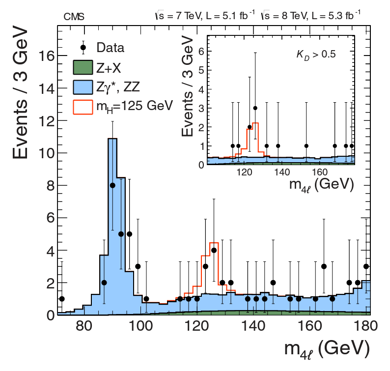

# higgs_boson_visualized

This Jupyter notebook is now available (and executable), thanks to 
[MyBinder](https://mybinder.org/). Or at least it should be, soon. 
I'm still figuring out the MyBinder thing. Try the link and see what
happens. If it's nothing, look at the Jupyter Notebook in the repo.

[](https://mybinder.org/v2/gh/bballdave025/higgs_boson_visualized/main?labpath=Higgs_Boson_Discovery_Visualization.ipynb)


# Brief Description

This is my progress on what's now my favorite visualization. I've been
working on doing a visualization of the Higgs-boson-discovery data, but with
my own twist. I've done some nuclear/particle physics research (I got my
MS Physics while doing such research.) More links/sources/etc. will be found
[further on](#My-History-And-Sources) in the README. If you want a shorter
version of what this is about, with more links and attempts at humor, you
can go there, first. You can think of that link a bit like a
[`Wanna Skip Physics?`](#My-History-And-Sources) button, a bit like the ones
in the actual notebook.

We are going to see if I can do an analysis that leads to something similar to
the discovery plot for the Higgs, which you can see right after this text.

<br/>
<div>
  
</div>
<br/>

I have rather enjoyed this visualization, when I wasn't cussing it out.
That's how things seem to go when you're working with data, especially with
learning new tools with a new dataset using some skills you haven't much
used for ten years (so say I 20230321T175500-0600). 


# My-History-And-Sources

The first visualization I'll do here is from my academic background - MS Physics at the University of California at Riverside with research at the **R**eletavistic **H**eavy **I**on **C**ollider - [RHIC](https://www.bnl.gov/rhic/) ([archived](https://web.archive.org/web/20230303001906/https://www.bnl.gov/rhic/)), specifically at a **P**ioneering **H**igh **E**nergy **N**uclear **I**nteraction e**X**periment - [PHENIX](https://www.phenix.bnl.gov/) ([archived](https://web.archive.org/web/20230305034745/https://www.phenix.bnl.gov/)). I was able to be part of the research and discussion - much more discussion than research - concerning the discovery of the Higgs Boson, which happened at [CERN](https://www.home.cern/)'s ([archived](https://web.archive.org/web/20230305014745/https://www.home.cern/)) LHC - in France and Switzerland.

I'm following a [guide](https://opendata-education.github.io/en_Workshops/exercises/discussion.html) ([archived](https://web.archive.org/web/20230305034951/https://opendata-education.github.io/en_Workshops/exercises/discussion.html)) from the [Helsinki Institute of Physics](https://www.hip.fi/) ([archived](https://web.archive.org/web/20230305040722/https://www.hip.fi/)). The data comes from the **C**ompact **M**uon **S**olenoid - [CMS](https://home.cern/science/experiments/cms) ([archived](https://web.archive.org/web/20230305041155/https://home.cern/science/experiments/cms)) - experiment, which lives way under the ground of France on the **L**arge **H**adron **C**ollider - [https://www.hasthelargehadroncolliderdestroyedtheworldyet.com/](https://www.hasthelargehadroncolliderdestroyedtheworldyet.com/) ([archived](https://web.archive.org/web/20230216163611/https://hasthelargehadroncolliderdestroyedtheworldyet.com/)), oops, the official link is for the [LHC](https://www.home.cern/science/accelerators/large-hadron-collider) ([archived](https://web.archive.org/web/20230305041346/https://www.home.cern/science/accelerators/large-hadron-collider)), though I believe that the code from the former site is legit. Check it out.

```javascript
<script type="text/javascript">
if (!(typeof worldHasEnded == "undefined")) {
document.write("YUP.");
} else {
document.write("NOPE.");
}
</script>
```

Anyway, I'll use the data from CMS to visualize something analagous to discovery of the Higgs through the 4-lepton channel. Look at the pictures - they'll be cool. 

# Some More Details

## Roadblocks - Things that got in my way that may or may not be interesting

### The big bug

Not the right number (nJxAgzeSAI0&t=877s)

_The number you have called is being checked for trouble._

https://telephoneworld.org/wp-content/uploads/2020/12/4143270494.mp3

While analyzing the 
4-lepton data from the Higgs search (2011 and 2012 runs), I planned not
only to do the standard spectra on which one can see the Higgs's mass peak,
but to use my particle physics background to do a deeper look. The [discovery
image](https://inspirehep.net/literature/1124338) ([archived TODO]()) - I've 
made it easier to get straight to the image 
[here](https://inspirehep.net/files/6d3aa0c4fbefece34158f7f0c6e2e818) 
([archived TODO](#))) 
is of the invariant masses of the reconstructed particles. You can learn
more about invariant masses and reconstructed particles, 
i.e. parent particles, 
in the Jupyter Notebook (though I did create a `Wanna Skip Physics?` button) 
if you _absolutely_ need it). I decided to also look at the invariant mass of 
one of the daughter particles, with the idea of finding the invariant mass of
each of the four daughter leptons. 

However, I was not getting reasonably close to the right answer. 
I wasn't sure 
what the error bars for invariant mass were, but I'm pretty sure they 
weren't
on the order of 10 GeV/c^2. Don't worry if none of that made sense; 
it means 
I was misunderstanding something or just doing something wrong. I chased 
down the problem. I'd mismatched a letter. I plan on putting a link to a
screenshot of the diff showing the problem that was fixed.

### CSVs from online and My(new)Binder

I also had to overcome some other obstacles. One was a problem with
`pandas` not reading in the CSVs correctly, or at least not doing so as
a guide I was following suggested it
should. I also had the normal experience of solving problems as I learned a
new technology - [MyBinder](https://mybinder.org/) - which is awesome and 
which I highly suggest
to anyone. The notebook I'm putting up is a compromise between trying to show
how everything is done and a pure, talk-turkey presentation of the data. I
think it does a good job of a showing the relationship between data, coding,
and a person in data science/machine learning.

### More questions <strike>that</strike> **with which** Physics StackExchange might help <strike>with</strike>

I must admit, I still have some questions. I might still post on [Physics
StackExchange](https://physics.stackexchange.com/) . I hope some of the good
people there might answer some questions I have about
the radicand in the invariant
mass formula, i.e. the $E^2 - \lvert \textbf{p} \rvert^2$ part of the whole
$m_0 = \sqrt{E^2 - \lvert \textbf{p} \rvert^2}$. 
Part of my question is to ask 
if I'm handling things right when $\lvert \textbf{p} \rvert^2  >  E^2$.
Another thing I'd like to know is if my current computed observations of the
invariant masses of daughter leptons are within expected error.


I also look at the invariant mass of the system of particles to double-
check its invariant mass (and thus the invariant mass of the parent particle)
as a sort of sanity check on the whole invariant mass thing. For the physics
people, you might want to know that I've also included the final
mass histogram, Monte Carlo events, analysis of Higgs in the mass
regime, etc. in the notebook.


# For the future

I can also cross-reference the [ATLAS experiment](https://github.com/atlas-outreach-data-tools/notebooks-collection-opendata) ([archived](https://web.archive.org/web/20230305041631/https://github.com/atlas-outreach-data-tools/notebooks-collection-opendata)).

I'll also probably to a mass spectrum from PHENIX to relive the good ol' days. [Their github](https://github.com/PhenixCollaboration) ([archived](https://web.archive.org/web/20230305041735/https://github.com/PhenixCollaboration)) will likely be useful.
